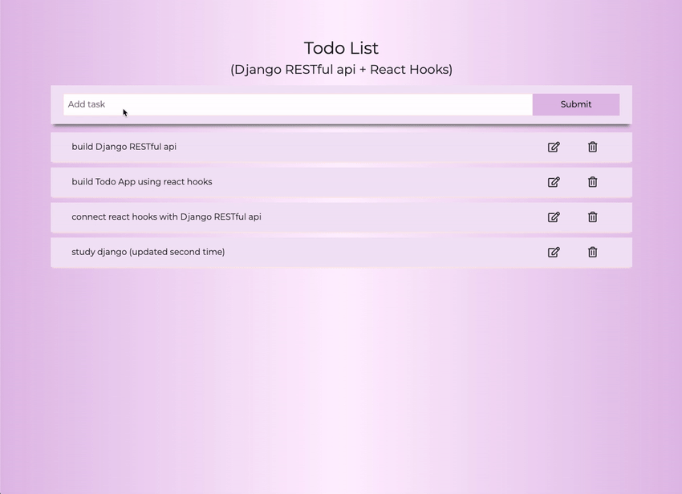

# Todo App (Django RESTful API + React Hooks)

## Django RESTful API + React __Hooks__

> python_Django(RESTful API) + React __Hooks__ todo app

## Live Demo
Try the application live at [https://jhmyung6225.pythonanywhere.com/](https://jhmyung6225.pythonanywhere.com/)

## Technologies Used
- React.js
- Hooks (useState, useEffect)
- CSS Variables 
- HTML
- Python
- Django RESTful API

## Features
  - Responsive design
  - User can write todo
  - User can update todo
  - User can delete todo
  - User can check completion of todo

## Preview

